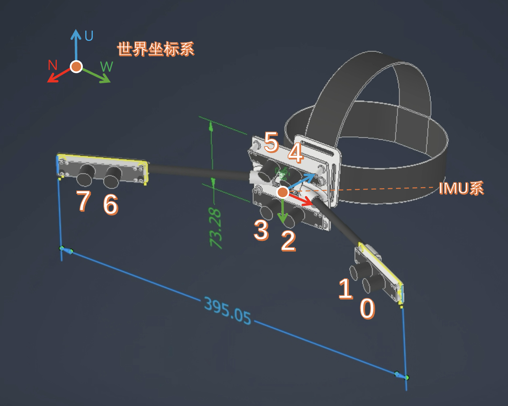

# 多相机+IMU 数据采集系统

多进程架构的数据采集工具，用于同步录制多个摄像头视频和 IMU 传感器数据。

## 文档

- 完整使用说明书: [docs/user_guide.md](docs/user_guide.md)

项目示意图：



## 快速开始

```bash
# 安装依赖
uv sync

# 运行 GUI 程序
uv run scripts/recorder_gui.py
```

## 回放工具（playback_gui.py）使用方法

用于同步回放多相机视频和 IMU 数据可视化。

### 1) 启动回放 GUI

```bash
uv run scripts/data_playback_gui.py
```

### 2) 准备数据目录

默认会扫描 `~/recordings`，也可以在界面左上角点击“浏览”选择其他目录。

每条录制数据建议包含：

```text
recording_YYYYMMDD_HHMMSS/
├── 0.mp4
├── 1.mp4
├── ...
└── imu_data.txt   # 可选（没有也可播放视频）
```

### 3) 界面操作

- 左侧列表选择某次录制，双击或点“播放”开始。
- “暂停/继续”控制播放状态。
- `<<`、`<`、`>`、`>>` 分别为 -30s、-5s、+5s、+30s 跳转。
- 可拖动进度条定位到任意时间。
- 速度支持 `0.25x ~ 4.0x`。
- 有 IMU 数据时可点击“3D姿态”打开交互 3D 姿态窗口。

## 项目结构

```
software/
├── scripts/recorder_gui.py   # 主程序（GUI）
├── config/config.yaml   # 配置文件
├── pyproject.toml       # 项目依赖配置
│
├── camera/              # 相机模块
│   ├── multi_camera.py  # 多线程相机流
│   └── mp_camera.py     # 多进程相机管理
│
├── imu/                 # IMU 模块
│   ├── imu_manager.py   # IMU 管理器
│   ├── port_manager.py  # 串口管理
│   └── yis_std_dec.py   # 协议解码
│
└── scripts/             # 辅助脚本
    ├── imu_test.py      # IMU 测试
    ├── visualize.py     # 2D 可视化
    └── visualize_3d.py  # 3D 可视化
```

## 功能特性

- **多进程架构**：每个相机独立进程，绑过 Python GIL
- **同步录制**：多相机 + IMU 数据同步采集
- **实时预览**：低延迟相机画面预览
- **高帧率**：支持 30fps @ 640x480

## 输出格式

每次录制生成带时间戳的目录：

```
recording_20260207_120000/
├── 0.mp4              # 相机 0 视频
├── 1.mp4              # 相机 1 视频
├── imu_data.txt       # IMU 数据（CSV）
└── recording_info.txt # 录制信息
```

## 配置

编辑 `config/config.yaml`：

```yaml
camera:
  ids: [0, 1, 2, 3]    # 相机 ID 列表
  width: 640
  height: 480

imu:
  port: /dev/tty.usbserial-xxx
  bps: 460800
```

## ROS2 驱动包

仓库已新增标准 ROS2 Python 包：

- [helmet_recorder_ros2/](helmet_recorder_ros2/)

构建与运行：

```bash
colcon build --packages-select helmet_recorder_ros2
source install/setup.bash

ros2 run helmet_recorder_ros2 camera_publisher
ros2 run helmet_recorder_ros2 aruco_calib
ros2 run helmet_recorder_ros2 save_cam_extrinsics
```

## 脚本命名规范（scripts）

已统一为按功能前缀命名：

- `cam_*`：相机标定与外参可视化
- `imu_*`：IMU 工具与可视化
- `ros2_cam_*`：ROS2 相机相关脚本
- `data_*`：数据回放与处理

常用新脚本：

- `scripts/data_playback_gui.py`
- `scripts/cam_calib_standalone.py`
- `scripts/cam_extrinsics_visualizer.py`
- `scripts/ros2_cam_publisher.py`
- `scripts/ros2_cam_aruco_calib.py`
- `scripts/ros2_cam_save_extrinsics.py`

旧名对照（已重命名）：

- `playback_gui.py` -> `data_playback_gui.py`
- `standalone_calib.py` -> `cam_calib_standalone.py`
- `visualize_cam_extrinsics.py` -> `cam_extrinsics_visualizer.py`
- `find_imu_port.py` -> `imu_find_port.py`
- `imu_test.py` -> `imu_yesense_test.py`
- `visualize.py` -> `imu_visualize_2d.py`
- `visualize_3d.py` -> `imu_visualize_3d.py`
- `ros2_camera_publisher.py` -> `ros2_cam_publisher.py`
- `ros2_camera_aruco_calib.py` -> `ros2_cam_aruco_calib.py`
- `ros2_save_cam_extrinsics.py` -> `ros2_cam_save_extrinsics.py`
- `ros2_multi_cam_vis.py` -> `ros2_cam_viewer.py`
- `ros2_multi_cam_aruco_vis.py` -> `ros2_cam_aruco_viewer.py`